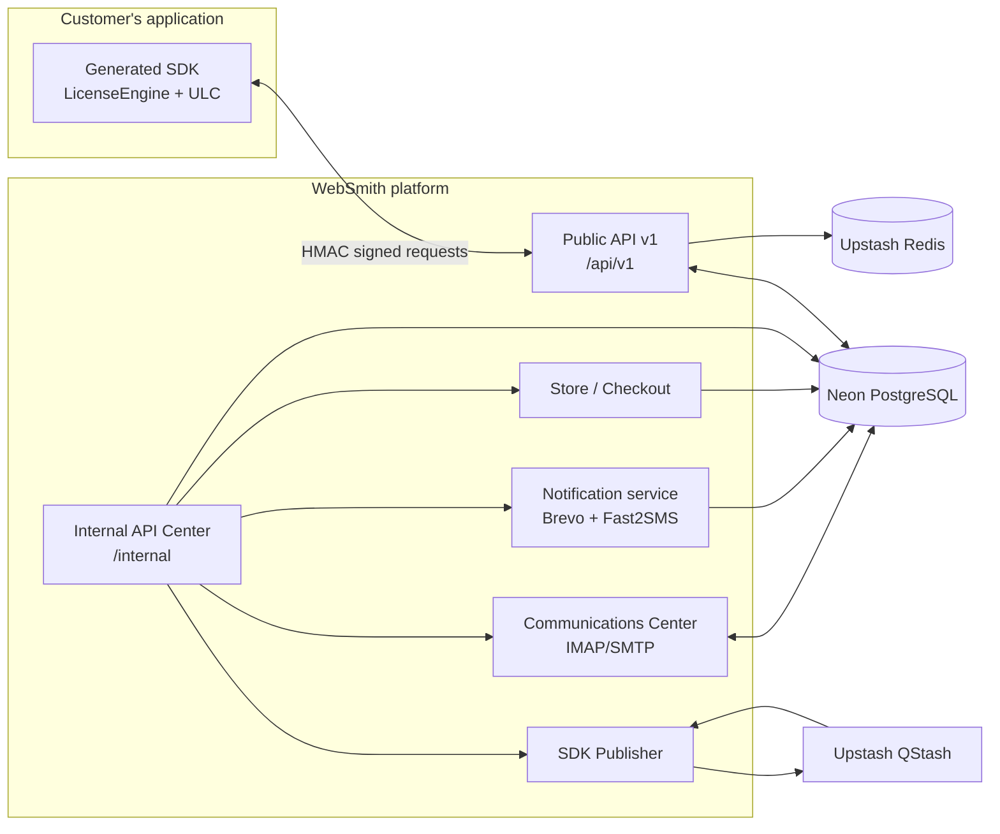
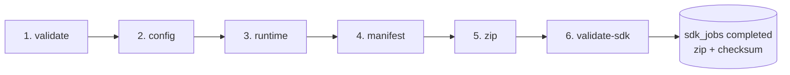

# 02 — Architecture

## Technology stack

| Layer | Technology | Notes |
|---|---|---|
| Framework | Next.js ^16.2.1 (App Router), React 19, TypeScript | Route handlers for API, server/client components. |
| Database | PostgreSQL on Neon (`@neondatabase/serverless`, `pg`) | Single serverless pool, `ssl rejectUnauthorized:false`. |
| Queues / cache | Upstash Redis + Upstash QStash + Upstash Workflow | Rate limiting, SDK job queue, background generation. |
| Email | Nodemailer SMTP (Pooled) | Exclusively delivers all outbound email (OTP, password reset, notifications, invoices) via pooled SMTP. |
| SMS | Fast2SMS | `https://www.fast2sms.com/dev/bulkV2`, config-gated. |
| IMAP/SMTP | `imap`, `nodemailer`, `mailparser` | Outbound delivery via pooled Nodemailer SMTP; external mailboxes in Communications Center. |
| Auth | `jose` (JWT verify in proxy), `jsonwebtoken`, `bcryptjs` | API Center sessions. |
| Packaging | `archiver` | SDK zip creation. |
| Misc | `axios`, `better-sqlite3` | Present in deps; Neon Postgres is the sole active datastore. |

## Repository layout

```
app/
  api/v1/            Public customer-facing API (route handlers)
  internal/
    api/             Admin API Center PAGES (store, sales, communications, …)
    backend/         Admin API route handlers (/internal/backend/*)
    publisher/       SDK generation pipeline (index, builders, runtimes/, template/)
  (public)           Public website pages (home, login, license, software-store…)
core/                Shared config (site, publicSite, oauth), services, utils, constants
lib/                 Shared backend logic (backend-db, public-api, email, sms, store,
                     invoice, notification, license, migrations, upstatsworkflow…)
docs/                Governance + documentation library
proxy.ts             Auth gate for /internal/*
```

## Layers (AWS-01 hierarchy)

```mermaid
flowchart TD
    A[Master Implementation Document<br/>docs/UNIVERSAL_LICENSE_PLATFORM_IMPLEMENTATION.md] --> B[Language Templates<br/>app/internal/publisher/template/<runtime>]
    B --> C[SDK Publisher<br/>app/internal/publisher]
    C --> D[Generated SDK (ZIP)<br/>output only - never edited]
    B -. implements .-> E[Public API v1<br/>app/api/v1]
    E --> F[(Neon PostgreSQL)]
```

Rules enforced by the pipeline: never edit generated SDKs directly; templates are the
only implementation source; publishers orchestrate/validate/package; generation fails
on duplicate implementation or runtime drift.

## System context



## Internal API Center

- **Auth**: `proxy.ts` runs on `/internal/:path*`. It verifies the `api_center_token`
  cookie or `Authorization: Bearer` JWT using `API_CENTER_JWT_SECRET` and injects
  `x-api-center-user-{id,email,role,name}` headers for downstream routes. Non-API
  requests that fail are redirected to `/internal/api/auth/login?next=…`.
- **Public allow-list**: login/register/password-reset, health, store product listing,
  license/trial activation endpoints, and a few admin-trial/cleanup routes bypass the
  gate (`proxy.ts` `PUBLIC_PATHS`).
- **Page → route pattern**: every page in `app/internal/api/*` calls
  `app/internal/backend/*` routes with the JWT; backend routes read the injected
  user headers instead of trusting the client.

## SDK Publisher pipeline

The publisher (`app/internal/publisher/index.ts`) orchestrates **six stages** with
checkpoint/resume backed by the `sdk_jobs` table:



- Builders: `config-builder.ts`, `runtime-selector.ts`, `runtime-builder.ts`,
  `manifest-builder.ts`, `zip-builder.ts`, `sdk-validator.ts`, `validator.ts`.
- Runtime generators live in `runtimes/<name>.ts` and only load templates, substitute
  placeholders, validate, and package — no business logic (AWS-01 Rule 11/14).
- Jobs are enqueued via `lib/public-api/queue.ts` to QStash
  (`POST /api/upstash/workflow`) and resumed from persisted stage artifacts after a
  timeout. Kit version = `WEBSMITH_CONTROLKIT_VERSION` or `package.json#version`.

## Public API v1

- File-system–based routes under `app/api/v1/*` (no central router).
- Common security flow: `X-API-Key` → `validateApiKey` → optional HMAC verification →
  rate limit → audit log (see `07-API-Reference.md`).
- Base URL for SDKs/QStash callbacks: `NEXT_PUBLIC_API_URL`.

## Communications architecture

- Mailboxes (`mailboxes` table) provide IMAP inbound sync and SMTP outbound through
  `[id]/sync` and `[id]/send`. The queue (`message_queue`) retries failed sends with
  exponential backoff (capped 60 min), processed by `queue/process`.
- Conversations (`communication_conversations` + `conversation_messages`) unify
  customer ↔ admin ↔ SDK ↔ support ↔ sales threads, with folders
  (`conversation_folders`), delivery logs (`notification_logs`), and attachment tables.
- The API Center page auto-syncs: processes the queue and syncs enabled mailboxes every
  45 s and on tab visibility.

## Notifications architecture

`triggerNotification(pool, eventType, ctx)` in `lib/notification/notification-service.ts`:

1. Reads per-event config from `event_notification_config` (fallback: email on, sms off).
2. Enriches context (customer, license+product, product, trial+product lookups).
3. Email via Brevo (`sendEmail`) when `email_enabled`; SMS via Fast2SMS when
   `sms_enabled` **and** `sms_config.enabled = true`.
4. Logs every channel attempt to `notification_logs` (statuses: `sent`, `failed`,
   `error`, `skipped`), creates an internal inbox row in `notifications`
   (`user_id='system'`), and writes an `audit_logs` row.

## Related docs

- `01-System-Overview.md`
- `05-Deployment.md`
- `08-Database.md`
- `09-AWS-01-Rules.md`
