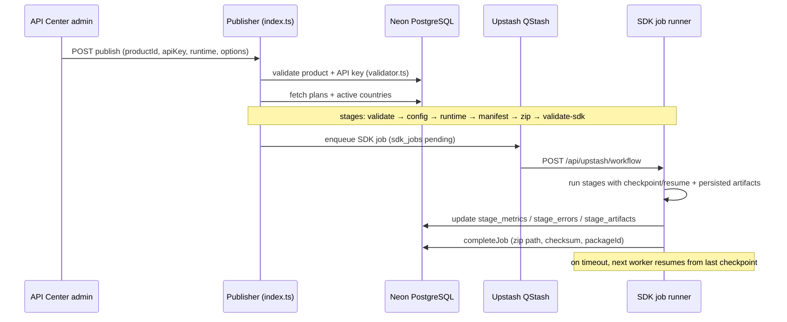
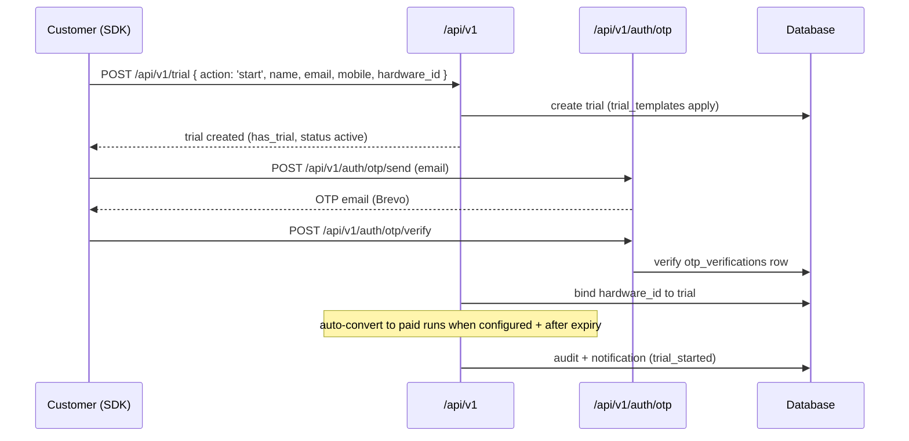
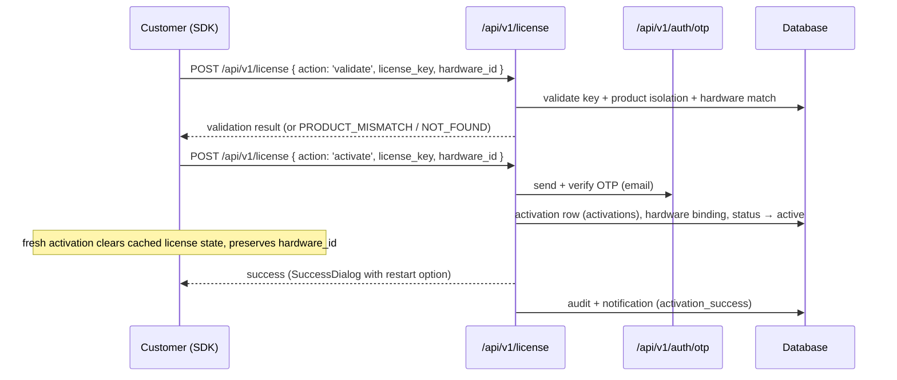
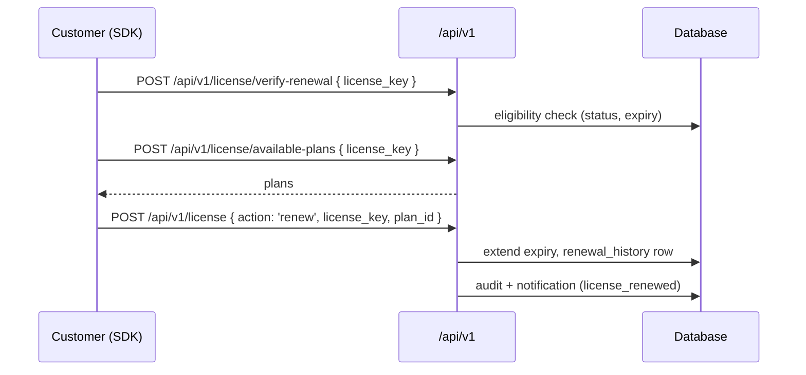
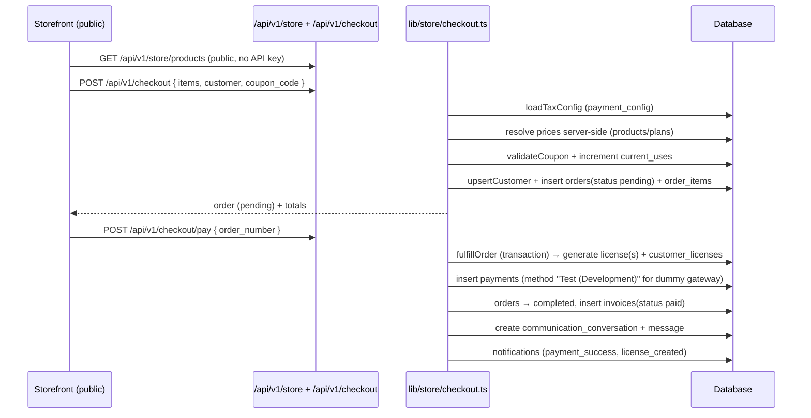
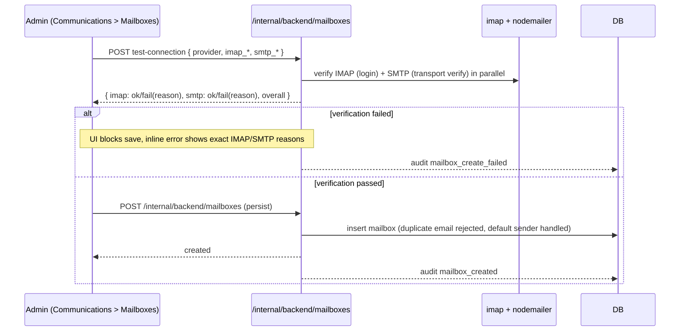

# 03 — Workflows

End-to-end flows across the platform. All endpoint references resolve in
`07-API-Reference.md`.

## 1. SDK generation (publisher workflow)

- Only completed stages are skipped on resume; the `runtime` stage is re-run if the
  ephemeral `/tmp` output directory is missing.
- Success cleans the temp directory; failure records the failing stage and marks the
  job failed (`failJob`). Both paths write `api_request_logs`.

## 2. Trial flow

- SDK detection uses `has_trial` **and** `status === 'active'` (bug fix history: the API
  returns `has_trial`, not `active`).
- Trial status is read from the backend; the cache is never authoritative.

## 3. License activation flow

- Hardware binding is **permanent**; a hardware mismatch invalidates only the cached
  status and surfaces "Hardware replacement requires administrator approval."
- After activation the SDK reloads live status from
  `GET /internal/backend/license/status`.

## 4. Renewal flow

## 5. Checkout / purchase flow

- **Invariant**: no payment → no license (license generation lives inside
  `fulfillOrder`, `lib/store/checkout.ts:363`).
- The checkout defaults to the **dummy gateway** (`payment_gateway = 'dummy'`); no real
  payment provider is integrated (see `04-Roadmap.md`).

## 6. Add a mailbox (admin workflow)

- Audit events: `mailbox_connection_test`, `mailbox_created`, `mailbox_create_failed`
  (readable at `GET /internal/backend/logs`).
- Error/success toasts render above open modals (`z-[100]`).
- Passwords are masked (`********`) and never rendered in plaintext; masked/blank
  passwords are stripped from PATCH payloads.

## 7. Communications: inbound email → conversation

1. `POST /internal/backend/mailboxes/[id]/sync` runs an IMAP sync of INBOX (UNSEEN).
2. Messages are parsed (`mailparser`), mapped to a `communication_conversations` row
   (by category, customer email, subject heuristics).
3. `conversation_messages` rows are inserted; `mailbox_sync_logs` and
   `connection_status`/`last_sync` are updated.
4. The API Center's auto-sync loop repeats this for every enabled mailbox every 45 s.

## 8. Support / sales / universal request flow

- SDK / customer posts `POST /api/v1/request` (types `BUY, RENEW, SUPPORT, ACTIVATION,
  DEVICE_REPLACEMENT, HARDWARE, GENERAL`) or `POST /api/v1/communication/create`.
- The communication is category-routed to the matching conversation folder and emails
  the right mail account (support vs sales) via `EMAIL_ROUTES`/`TYPE_CATEGORY` maps.
- Customers can follow up via `[id]/reply` and attach files
  (`[id]/attach` — MIME whitelist, 5 files × 10 MB).
- Admins reply inside the Communications Center; delivery is queued if SMTP fails.

## 9. Public contact form workflow

- Visitor submits `POST /api/tickets/public` with `name`, `email`, `callingPhone`, `whatsappPhone`, `preferredContactDate`, `company`, `subject`, and `message`.
- Browser auto-detects country code via `Intl.DateTimeFormat().resolvedOptions().timeZone` and locale; provides searchable country code picker and "Same as calling" toggle for WhatsApp.
- Route sanitizes fields and persists `contactCallingPhone`, `contactWhatsappPhone`, and `preferredContactDate` in MongoDB `tickets`.
- Instant Brevo alert email (`admin_notification`) is dispatched to the admin with direct `tel:` (call), `https://wa.me/` (WhatsApp chat), and admin panel `/admin/messages` links.
- Admin Messages panel (`AdminMessagesClient.tsx`) displays calling number, WhatsApp chat link, and preferred contact date badge under Client Details and thread header.

## Related docs

- `02-Architecture.md`
- `06-Administrator-Guide.md`
- `07-API-Reference.md`
- `09-AWS-01-Rules.md` (Rules 1–10 ULC event messaging, Rule 10 validation scenarios)
