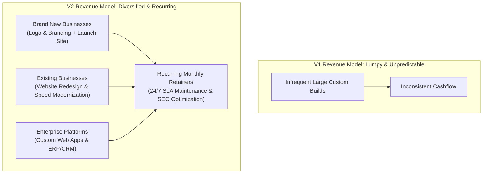

# WebSmith Digital — Services & Industries Architecture Comparison

> **Document:** Version Comparison & Commercial Analysis  
> **Topic:** Earlier Engineering-Tooling Implementation (V1) vs. Current Market-Driven Agency Implementation (V2)  
> **Target Audience:** Agency Leadership, Product Managers, Sales & Technical Architects  

---

## 1. Executive Summary

This document provides a comprehensive, side-by-side architectural and business comparison between:
- **Version 1 (Earlier Implementation)**: Developer-centric, heavy on internal infrastructure and software licensing tooling (Universal Licensing Platform SDKs, microservices, gRPC, and RAG vector search).
- **Version 2 (Current Implementation)**: Market-driven, buyer-centric agency structure designed for global clients (US, UK, UAE, Kuwait, India, Australia) with 8 specific target industries and 13 core commercial services.

---

## 2. High-Level Architectural Comparison

| Dimension | Earlier Version (V1)<br>*(Software Engineering & Deep-Tech Tooling)* | Current Version (V2)<br>*(Commercial Agency & Client-Targeted Solutions)* | Strategic Impact |
|---|---|---|:---:|
| **Agency Positioning** | Deep-tech developer lab & desktop licensing infrastructure provider. | Full-cycle Digital Agency: High-Performance Websites, Custom Software, Apps & Branding. | **V2 Wins** (Clear & Versatile) |
| **Primary Buyer Persona** | Technical CTOs, backend engineers, desktop software vendors needing DRM. | Business Owners, Startup Founders, Marketing Directors, Clinic Admins, Real Estate Brokers, Enterprise IT. | **V2 Wins** (10x larger addressable market) |
| **Pillar Structure** | 5 Developer Categories (22 items, heavily technical). | 5 Client-Centered Suites (13 clear, production-grade services). | **V2 Wins** (Higher conversion clarity) |
| **Website Offerings** | Generic "Web App Development" (no explicit marketing website service). | Dedicated **"Website & Landing Page Development"** AND **"Custom Web Applications"**. | **V2 Wins** (Captures both marketing sites & complex apps) |
| **Website Redesign** | ❌ **Missing**: Assumed all clients are building greenfield projects from scratch. | ✅ **Explicit Service**: **"Website Redesign & Modernization"** (legacy revamps, 3x–10x speedup, mobile overhaul). | **V2 Wins** (Captures massive redesign market) |
| **Brand & Creative Design** | Limited to UI/UX component libraries and wireframes. | Complete Creative Suite: **"UI/UX Design"** PLUS **"Logo & Brand Identity Design"** (vector logos, brand books, typography, social kits). | **V2 Wins** (High-margin upsell for new businesses) |
| **Booking & Scheduling** | Hidden inside general calendar utilities. | ✅ **Dedicated Service**: **"Booking & Appointment Systems"** (multi-timezone, automated SMS/WhatsApp reminders). | **V2 Wins** (Crucial for clinics, consultants & salons) |
| **Recurring Revenue Streams** | Weak: Mostly one-off custom software builds. | Strong: Packaged monthly retainers for **"Maintenance & Support (24/7 SLA)"** and **"SEO & Performance"**. | **V2 Wins** (Predictable recurring cash flow) |
| **Industry Verticals** | 5 General Verticals (FinTech, E-Commerce, Healthcare, SaaS, Logistics). | **8 High-Spending Global Verticals** (Startups & SMBs, Healthcare, Real Estate, Education, E-Commerce, Restaurants & Hospitality, Professional Services, Logistics). | **V2 Wins** (Direct domain positioning) |
| **Licensing Platform (ULP)** | Prominently displayed as a main agency offering (confused web development prospects). | Kept in the software store / backend where it belongs, without cluttering agency services. | **V2 Wins** (Eliminates buyer confusion) |
| **Client Psychology** | *"This agency looks like a backend developer lab. Can they design a beautiful, modern website for my business?"* | *"This agency understands my industry, can design my logo, build my website, launch my mobile app, and manage my cloud."* | **V2 Wins** (Builds immediate trust) |
| **Technical Depth** | High: Exposed raw architecture terms (gRPC, Kafka, Docker). | High: Delivers the same modern architecture (Next.js 16, React 19, PostgreSQL, Docker) under easy-to-understand deliverables. | **Tie** (Technical rigor is preserved) |

---

## 3. Service Breakdown Comparison

### Version 1: Earlier Implementation (5 Categories, 22 Items)
Focused on internal engineering disciplines rather than business solutions:

```
V1 Category Structure:
├── 1. Software Engineering (Web Apps, Mobile, Microservices, Cloud Cache, DevOps, Modernization)
├── 2. Enterprise ERP & CRM (Custom ERP, CRM Workflow, Inventory, Billing, Client Portals, Third-Party Sync)
├── 3. Universal Licensing ULP (Licensing Engine, 13-Language Native SDKs, Trial Automation, ULC GUI)
├── 4. Design & Product (UI/UX Architecture, Design Systems, Product Prototyping)
└── 5. AI Solutions (AI Agent Orchestration, Private LLM/RAG, Intelligent Document Processing)
```

**Drawbacks of V1**:
1. **ULP Distraction**: Presenting a desktop software licensing engine alongside web development confused 80%+ of incoming leads who thought WebSmith was a security software vendor.
2. **Missing Everyday High-Ticket Services**: No explicit services for *Website Redesign*, *Logo & Brand Identity*, *Booking & Appointment Systems*, or *Ongoing Maintenance Retainers*.
3. **Overly Technical Jargon**: Clients were intimidated by terms like "Decoupled microservices with gRPC gateways" when all they wanted was a fast website with online payment integration.

---

### Version 2: Current Implementation (5 Suites, 13 Core Services)
Focused directly on client intent, buyer search patterns, and agency profitability:

```
V2 Suite Structure:
├── Suite 1: Web Engineering & Redesign
│   ├── 1. Website & Landing Page Development (Next.js 16, Sub-Second TTFB, ADA Compliant)
│   ├── 2. Website Redesign & Modernization (Legacy Facelift, 3x-10x Speedup, Mobile Overhaul)
│   ├── 3. Custom Web Applications (Scalable SaaS, Client Portals, Multi-Tenant RBAC)
│   └── 4. E-commerce Development (Custom Stores, Shopify Plus, High-Speed Checkout)
├── Suite 2: Mobile & App Engineering
│   └── 5. Mobile App Development (Cross-Platform iOS & Android, React Native, Flutter, Offline PWA)
├── Suite 3: Business Software & Integrations
│   ├── 6. CRM / ERP / Business Software (Operations, Kanban Pipeline CRM, Multi-Branch ERP)
│   ├── 7. Booking & Appointment Systems (Multi-Timezone Calendars, SMS/WhatsApp Alerts)
│   └── 8. API & Payment Integrations (Stripe, PayPal, Razorpay, KNET, Custom Webhooks)
├── Suite 4: Creative, Design & Branding
│   ├── 9. UI/UX Design & Prototyping (Interactive Figma Prototypes, Design Tokens)
│   └── 10. Logo & Brand Identity Design (Vector Logos, Brand Books, Typography, Social Kits)
└── Suite 5: Cloud, Performance & Growth
    ├── 11. Cloud & Deployment (AWS, Vercel, Docker, CI/CD, Zero-Downtime Releases)
    ├── 12. Maintenance & Support (24/7 SLA Guarantee, Security Patches, Backups)
    └── 13. SEO & Performance Optimization (Core Web Vitals 95+, Technical SEO, Schema)
```

**Advantages of V2**:
1. **Client Intent Alignment**: Matches exact commercial Google search queries (e.g. *"website redesign company"*, *"e-commerce developer"*, *"clinic appointment booking system"*).
2. **Comprehensive Lifecycle**: You can take a client from **Logo Design → Website Development → Mobile App → Cloud Deployment → 24/7 Maintenance Retainer**.
3. **Clean Technical Framing**: High engineering standards (Next.js 16, React 19, TypeScript, PostgreSQL) are presented as **deliverables and guarantees** rather than confusing buzzwords.

---

## 4. Industry Verticals Comparison

| Industry | Included in V1? | Included in V2? | Commercial Rationale for V2 |
|---|:---:|:---:|---|
| **Startups & SMBs** | ❌ No | ✅ **Yes** | Huge market in US/UK/India for fast MVP delivery, pitch deck clickable prototypes, and agile builds. |
| **Healthcare** | ✅ Yes | ✅ **Yes** | Massive commercial budget for HIPAA/GDPR telemedicine portals, patient scheduling, and EHR/FHIR sync. |
| **Real Estate** | ❌ No | ✅ **Yes** | One of the largest software verticals in US, UAE (Dubai/Abu Dhabi), and UK (MLS/IDX feeds, Mapbox search, tenant portals). |
| **Education & EdTech** | ❌ No | ✅ **Yes** | Strong demand across GCC, India, and US for custom LMS platforms, video streaming, student portals, and course checkout. |
| **E-commerce & Retail** | ✅ Yes | ✅ **Yes** | Universal commercial demand for headless Shopify Plus storefronts, multi-vendor marketplaces, and flash-sale scaling. |
| **Restaurants & Hospitality** | ❌ No | ✅ **Yes** | High demand in US & GCC for direct online food ordering systems, table reservations, and digital QR menus to bypass aggregator fees. |
| **Professional Services** | ❌ No | ✅ **Yes** | Law firms, CPA accounting practices, and management consultancies need secure client intake portals and document vaults. |
| **Logistics** | ✅ Yes | ✅ **Yes** | Fleet GPS telematics, warehouse barcode ERP, and multimodal tracking across global freight hubs. |
| **FinTech & Banking** | ✅ Yes | *Merged* | Integrated directly across the FinTech/Payment integrations and E-Commerce architectures. |

---

## 5. Commercial & Revenue Model Comparison



### Why V2 Generates More Revenue:
1. **Lowers Client Acquisition Friction**:
   - In V1, a client had to commit to a massive custom software project right away.
   - In V2, clients can start with a smaller, high-margin entry project: **Logo & Brand Identity**, a **Website Redesign**, or an **SEO Acceleration Sprint**, then naturally expand into custom software and mobile apps.
2. **Built-in Recurring Monthly Retainers**:
   - **Maintenance & Support (24/7 SLA)** provides predictable monthly recurring revenue (MRR) per client.
   - **SEO & Performance Optimization** provides ongoing monthly retainer contracts.
3. **No Lost Opportunities**:
   - Clients with existing outdated websites are not turned away; they are channeled into the dedicated **Website Redesign & Modernization** service.

---

## 6. Final Recommendation

| Question | Assessment |
|---|---|
| **Which version is better for acquiring clients?** | **Version 2 (Current)** — By a wide margin. It speaks the language of paying clients and covers the entire digital service lifecycle. |
| **Did we lose any technical sophistication?** | **No.** All of the advanced engineering (Next.js 16, PostgreSQL, Docker, Redis, REST/GraphQL) remains the backbone of the deliverables. |
| **What happens to the Universal Licensing Platform (ULP)?** | ULP remains active in the codebase and powers the software store (`/software-store`) and licensing backend, where it functions as a product rather than cluttering agency services. |

**Conclusion**: Keep **Version 2**. It is commercially superior, eliminates buyer confusion, addresses the highest-spending global industries, and establishes WebSmith Digital as a comprehensive digital engineering powerhouse.
